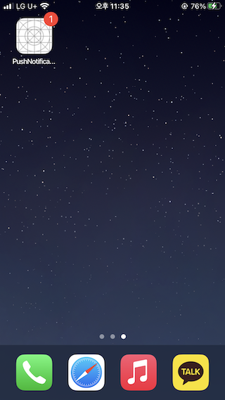

# Push-Notifications

## Firebase Cloud Messaging 동작
- Firebase -> Apple Push Notifications service(APNs) -> Application

  
## 알림 보내기
- Firebase project -> Engage -> Messaging -> New campaign

  
## 알림 수신
- 실 기기에서 수신

  
  

